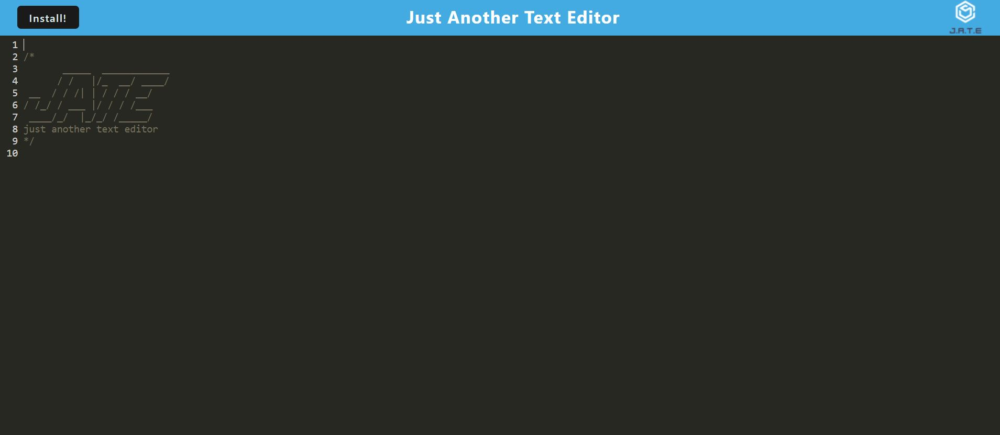

# Progressive Web Application Text Editor

## Description
A single page text editor featuring a number of data persistence techniques as redundencies that is able to function seemlessly offline. 
This application was completed using starter code provided by Georgia Techs Coding Boot Camp.

## Installation
* run npm i to install the dependencies
* npm run star will begin the application
* The package.json file has scripts for easy running of the application using different paramaters

## License
MIT

## Mockup

[Heroku Deployed Application](https://agile-meadow-18370.herokuapp.com/)

## Contact Me
* [Github Portfolio](https://github.com/ChanceSupcoe)
* Email : chancesupcoe@gmail.com
